# Manual de Usuario — Eternamente Wedding Planner

Bienvenida al manual de uso de la página web de **Eternamente**, la plataforma online de la agencia de wedding planners. Este documento explica, paso a paso, cómo navegar por la web y utilizar todas sus funcionalidades, tanto si entras como visitante, como si eres una pareja con cuenta o un miembro del equipo administrador.

---

## Índice

1. [Acceso a la web](#1-acceso-a-la-web)
2. [Recorrido por la página de inicio](#2-recorrido-por-la-página-de-inicio)
3. [Crear una cuenta nueva (registro)](#3-crear-una-cuenta-nueva-registro)
4. [Iniciar sesión](#4-iniciar-sesión)
5. [Recuperar contraseña olvidada](#5-recuperar-contraseña-olvidada)
6. [Verificación de tu correo electrónico](#6-verificación-de-tu-correo-electrónico)
7. [Panel del cliente (parejas)](#7-panel-del-cliente-parejas)
   - 7.1. [Cuestionario inicial](#71-cuestionario-inicial)
   - 7.2. [Pendiente de reunión](#72-pendiente-de-reunión)
   - 7.3. [Resumen de la boda](#73-resumen-de-la-boda)
   - 7.4. [Personalización (elegir proveedores)](#74-personalización-elegir-proveedores)
   - 7.5. [Organizador de mesas e invitados](#75-organizador-de-mesas-e-invitados)
   - 7.6. [Presupuesto](#76-presupuesto)
   - 7.7. [Chat con el equipo](#77-chat-con-el-equipo)
   - 7.8. [Mi perfil](#78-mi-perfil)
8. [Panel del administrador (equipo Eternamente)](#8-panel-del-administrador-equipo-eternamente)
9. [Cerrar sesión](#9-cerrar-sesión)
10. [Estados de tu boda](#10-estados-de-tu-boda)
11. [Preguntas frecuentes](#11-preguntas-frecuentes)

---

## 1. Acceso a la web

Abre tu navegador (Chrome, Firefox, Edge o Safari) y entra en la dirección de la página principal. La web es **responsive**, es decir, se adapta automáticamente al tamaño de tu pantalla, tanto si estás en ordenador, tablet o móvil.

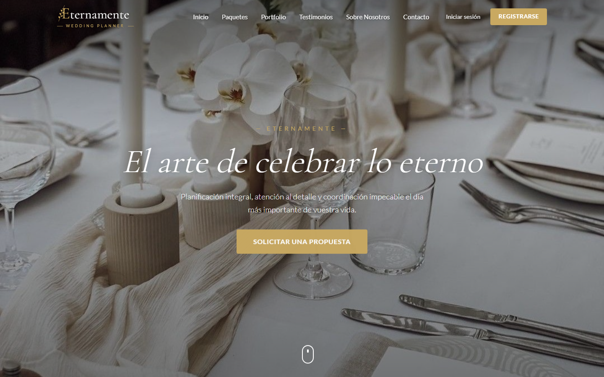

En la parte superior verás siempre la **barra de navegación (navbar)** con:

- El logo de Eternamente, que te lleva al inicio.
- Enlaces directos a las secciones: **Inicio, Paquetes, Portfolio, Testimonios, Sobre Nosotros, Contacto**.
- Botones de **Iniciar sesión** y **Registrarse** (si aún no tienes cuenta).
- Si ya has iniciado sesión, en lugar de los botones anteriores aparecerá tu nombre y un acceso a tu **Panel**.

En móvil, los enlaces se ocultan tras un icono de menú (☰) que despliega la navegación.

---

## 2. Recorrido por la página de inicio

La página principal está dividida en secciones que puedes recorrer haciendo scroll o usando los enlaces del navbar:

### 2.1. Hero (Inicio)
Imagen de portada con el lema de la agencia y un botón **"Ver paquetes"** que hace scroll suave hasta la sección de paquetes.

### 2.2. Paquetes
Muestra los paquetes de boda que ofrece Eternamente con su precio y descripción. Sirve para que las parejas vean de un vistazo las opciones disponibles antes de contactar.

### 2.3. Portfolio
Galería con fotografías de bodas anteriores organizadas por estilos. Pulsa sobre cualquier imagen para verla ampliada.

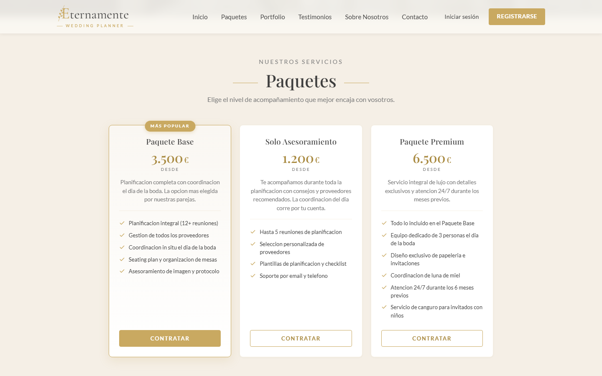

### 2.4. Testimonios
Opiniones reales de parejas que ya han celebrado su boda con Eternamente.

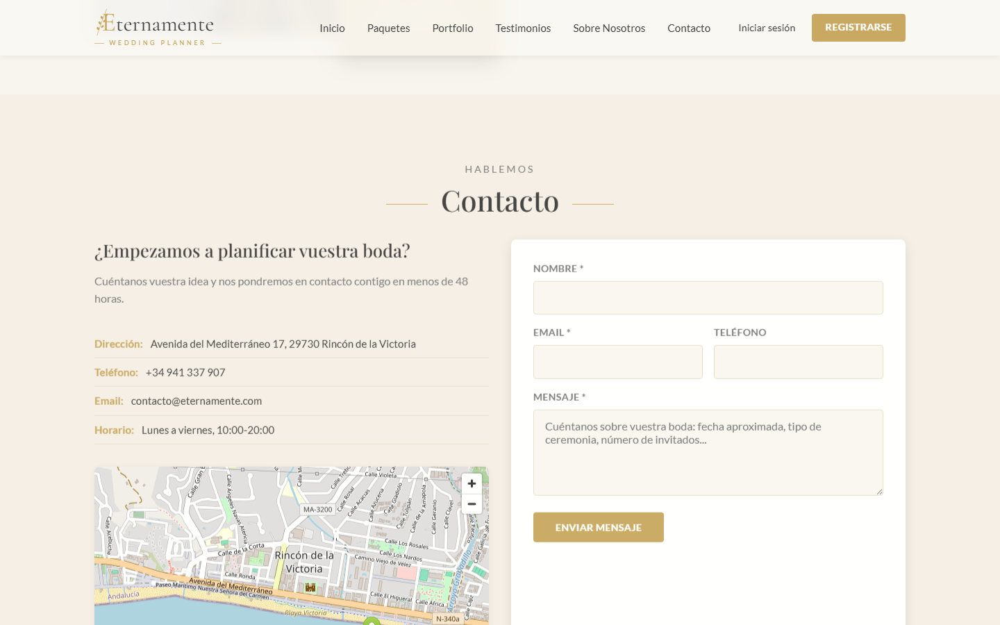

### 2.5. Sobre Nosotros
Presentación del equipo, los valores de la agencia y la filosofía de trabajo.

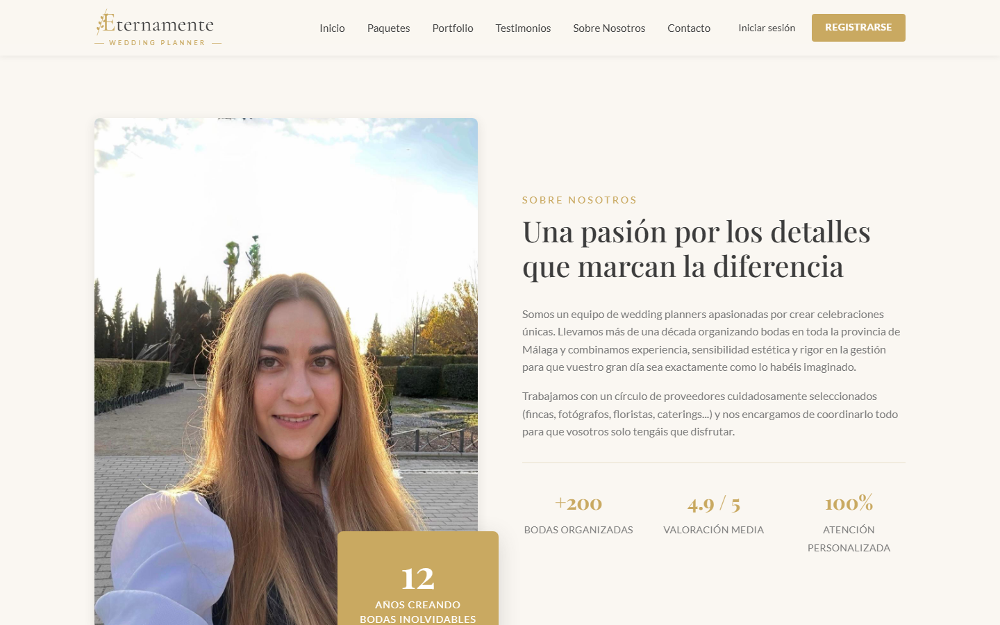

### 2.6. Contacto
Formulario para enviar un mensaje sin necesidad de tener cuenta. Para usarlo:

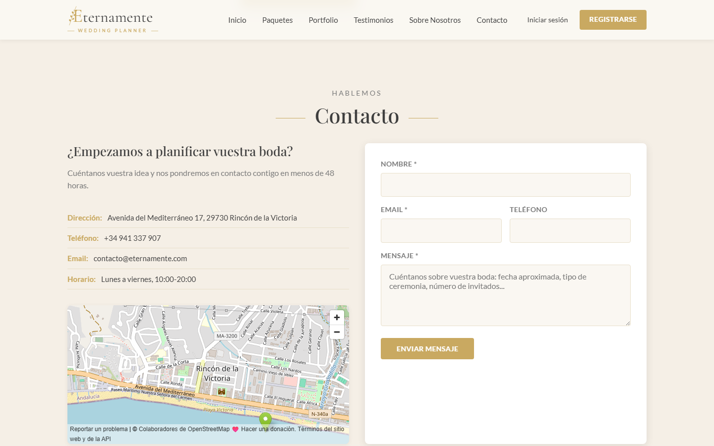

1. Rellena los campos **Nombre**, **Email** y **Mensaje** (mínimo 10 caracteres). El **Teléfono** es opcional.
2. Pulsa el botón **Enviar**.
3. Si todo es correcto verás un mensaje de éxito y el formulario se vaciará. El equipo de Eternamente recibirá tu mensaje en su panel y te responderá.
4. Si hay un error, se mostrará un aviso en rojo con el motivo.

### 2.7. Footer (pie de página)
Datos de contacto, redes sociales y avisos legales.

---

## 3. Crear una cuenta nueva (registro)

Para empezar a planificar tu boda con Eternamente necesitas una cuenta. Pulsa **"Registrarse"** en el navbar.

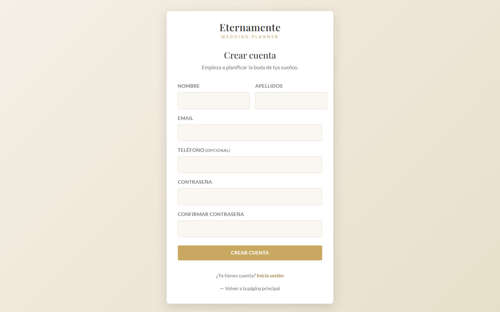

**Pasos:**

1. Rellena el formulario con:
   - **Nombre** (obligatorio).
   - **Apellidos** (obligatorio).
   - **Email** (obligatorio, debe ser un correo válido).
   - **Teléfono** (opcional).
   - **Contraseña**: mínimo 8 caracteres y debe contener al menos una **letra mayúscula**, una **letra minúscula** y un **número**.
   - **Confirmar contraseña**: debe coincidir con la anterior.
2. Pulsa **Crear cuenta**.
3. Si todo es correcto, recibirás un email de verificación en la dirección indicada y serás redirigido automáticamente a tu panel pasados unos segundos.
4. Si algún campo está mal, el sistema te lo señalará en rojo con el motivo (por ejemplo, contraseñas que no coinciden).

> **Importante:** hasta que no verifiques tu correo, no podrás rellenar el cuestionario inicial de tu boda.

---

## 4. Iniciar sesión

Si ya tienes cuenta, pulsa **"Iniciar sesión"** en el navbar.

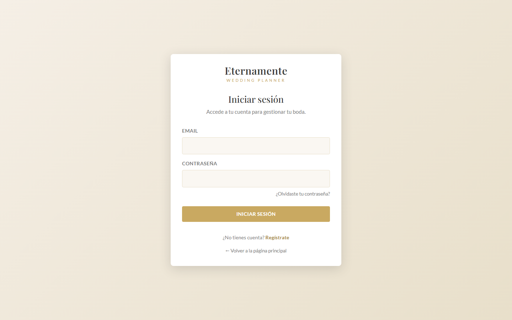

**Pasos:**

1. Introduce tu **email** y tu **contraseña**.
2. Pulsa **Entrar**.
3. Si las credenciales son correctas:
   - Si eres **cliente**, irás directamente a tu panel personal (`/panel`).
   - Si eres **administrador**, irás al panel de administración (`/admin`).
4. Si las credenciales son incorrectas, aparecerá un mensaje de error y deberás volver a intentarlo.

Si has olvidado la contraseña, pulsa el enlace **"¿Has olvidado tu contraseña?"** debajo del formulario.

---

## 5. Recuperar contraseña olvidada

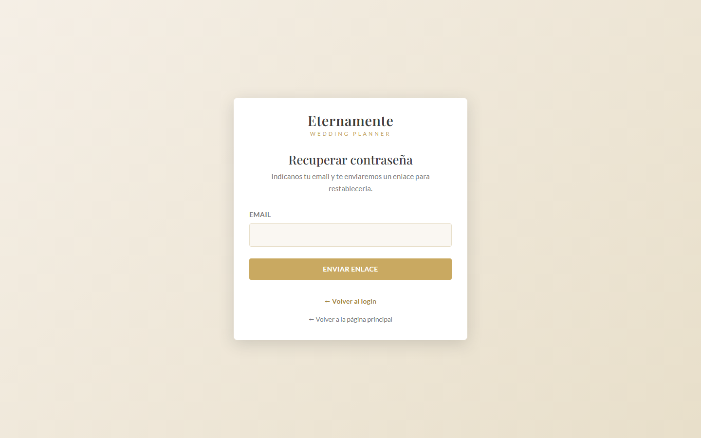

1. Desde el formulario de inicio de sesión pulsa **"¿Has olvidado tu contraseña?"**.
2. Introduce el **email** asociado a tu cuenta y pulsa **Enviar enlace**.
3. Recibirás un correo con un botón/enlace para recuperar la contraseña. **El enlace caduca**, úsalo cuanto antes.
4. Al pulsar el enlace, la web abrirá un formulario donde podrás escribir tu **nueva contraseña** (mismas reglas que en el registro: 8+ caracteres, mayúscula, minúscula y número) y confirmarla.
5. Pulsa **Guardar nueva contraseña**. Pasados unos segundos, serás redirigido a la pantalla de inicio de sesión para entrar con tu nueva clave.

> Si el enlace ha caducado, vuelve al paso 1 y solicita uno nuevo.

---

## 6. Verificación de tu correo electrónico

Tras registrarte recibirás un email automático con un botón **"Verificar mi cuenta"**. Pulsa ese botón:

- Se abrirá la web en una pantalla de confirmación informándote de que tu correo ha sido verificado.
- Desde ese momento podrás acceder a todas las funcionalidades del panel.

Si no recibes el correo o lo borras por error, dentro de tu panel hay un aviso amarillo con el botón **"Reenviar email de verificación"**.

---

## 7. Panel del cliente (parejas)

Una vez dentro del panel, verás:

- En la **parte izquierda** (o desplegable en móvil) un menú lateral con los apartados disponibles.
- En la **parte superior**, una **cuenta atrás** con los días que faltan para tu boda (cuando ya hayas indicado la fecha) y una etiqueta con el **estado actual** de la boda.
- El **contenido principal** cambia según la sección elegida.

> Algunas secciones (Personalización, Mesas, Presupuesto, Chat) **solo se desbloquean cuando tu boda pasa al estado "Activa"**, es decir, después de la primera reunión con el equipo.

### 7.1. Cuestionario inicial

La primera vez que entres al panel se te pedirá completar un cuestionario en **4 pasos** para que el equipo conozca tu boda. Puedes avanzar y retroceder entre pasos sin perder los datos.

**Paso 1 – Datos básicos:**
- Nombre de la pareja.
- Tipo de ceremonia: religiosa, civil ayuntamiento/juzgado, simbólica o renovación de votos.
- Lugar de celebración: iglesia, ayuntamiento, finca, playa, jardín, restaurante u otro.
- Fecha prevista.

**Paso 2 – Detalles del evento:**
- Número de invitados (entre 1 y 2000).
- Franja horaria: mañana (antes de las 14h), tarde (14h–20h) o noche (después de las 20h).

**Paso 3 – Estilo:**
- Temática: clásica 🌹, rústica 🌾, moderna ✨, boho 🌿 o glamour 💎.
- Tipo de comida: cóctel, banquete, buffet o familiar.

**Paso 4 – Presupuesto orientativo:**
- Hasta 10.000 €, 10.000–20.000 €, 20.000–35.000 €, 35.000–50.000 € o más de 50.000 €.

Al finalizar, pulsa **Enviar cuestionario**. Tu boda quedará en estado **"Pendiente de reunión"** y el equipo de Eternamente se pondrá en contacto contigo.

> Si todavía no has verificado tu correo, el botón de envío estará deshabilitado y aparecerá el aviso para reenviar el email de verificación.

### 7.2. Pendiente de reunión

Es la pantalla que verás justo después de enviar el cuestionario. Resume los datos de tu boda y te informa de que el equipo se pondrá en contacto contigo para concertar la primera reunión presencial o por videollamada.

Mientras estés en este estado, puedes seguir consultando o editando tus datos básicos desde **Resumen**.

### 7.3. Resumen de la boda

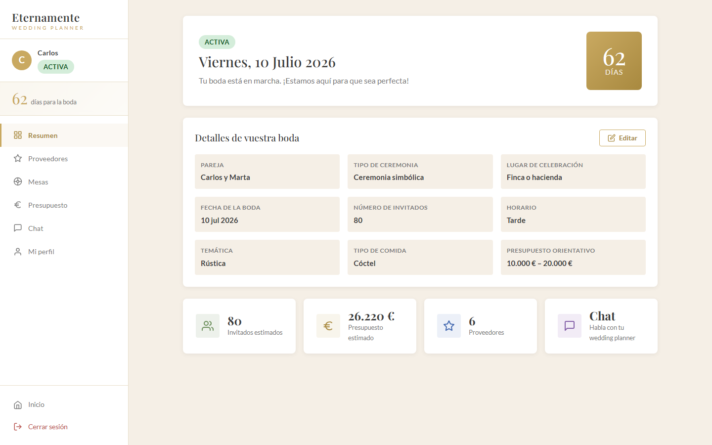

Vista general de tu boda con:

- Cuenta atrás de días restantes.
- Estado actual.
- Todos los datos del cuestionario.

**Para editar los datos:**

1. Pulsa el botón **Editar detalles**.
2. Modifica los campos que necesites (mismos que en el cuestionario).
3. Pulsa **Guardar cambios**. Verás un mensaje verde de confirmación.
4. Si prefieres descartar, pulsa **Cancelar**.

> Solo se pueden editar los detalles cuando la boda está en estado **"Pendiente de reunión"** o **"Activa"**. Una vez finalizada o cancelada, los datos quedan en modo lectura.

### 7.4. Personalización (elegir proveedores)

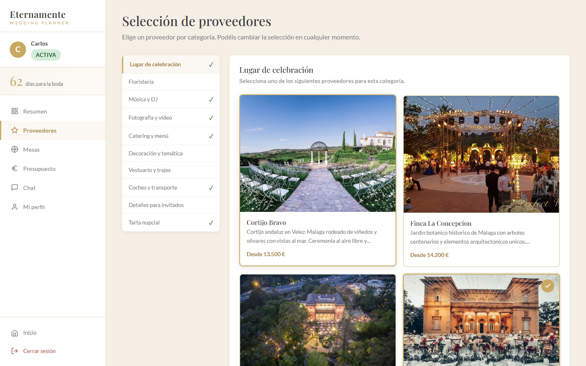

Sección para escoger los proveedores de cada categoría que prepararán tu boda (lugar, catering, fotografía, decoración, música, etc.).

**Cómo funciona:**

1. En la parte superior verás unas pestañas con las categorías disponibles. Pulsa la que quieras configurar.
2. Verás tarjetas con cada proveedor: nombre, descripción, precio y foto.
3. Pulsa sobre la tarjeta para **seleccionarlo**. Solo puedes elegir **un proveedor por categoría**: si seleccionas otro, el anterior se deselecciona automáticamente.
4. Repite con todas las categorías.
5. Pulsa **Guardar selección** al final.
6. Verás un mensaje verde de confirmación si todo va bien.

Las categorías que ya tienen una selección aparecen marcadas en el menú para que sepas tu progreso.

### 7.5. Organizador de mesas e invitados

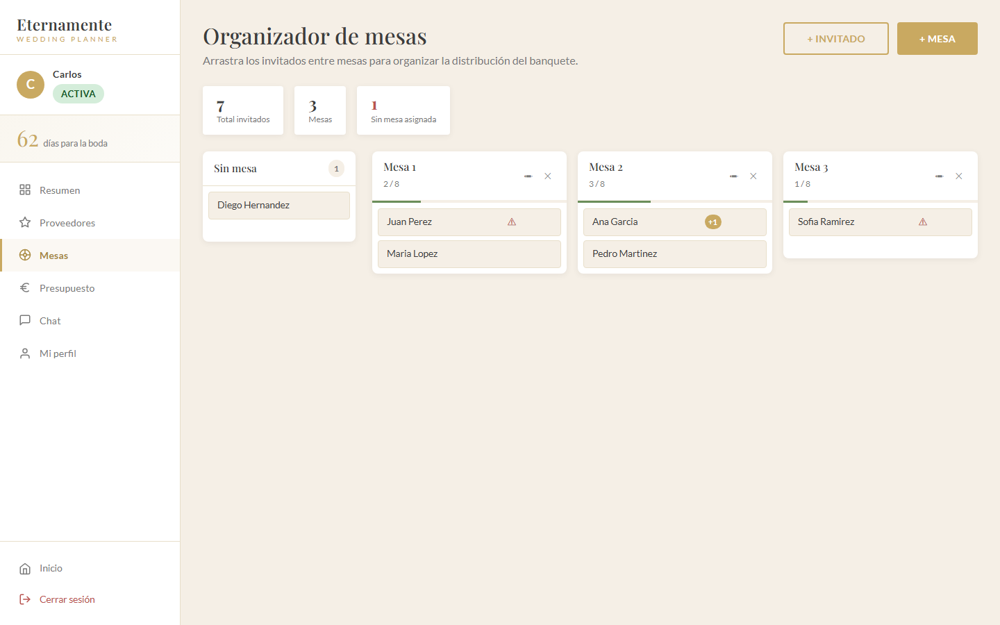

Herramienta visual para distribuir a tus invitados por mesas mediante **arrastrar y soltar (drag & drop)**.

**Crear una mesa:**

1. Pulsa **+ Nueva mesa**.
2. Introduce el **número de mesa** y la **capacidad** (entre 1 y 100 personas).
3. Pulsa **Guardar**.

**Editar o eliminar una mesa:**

- Cada mesa tiene iconos de editar y eliminar. Si eliminas una mesa, los invitados que tenía pasan automáticamente a la zona **"Sin mesa"**.

**Añadir un invitado:**

1. Pulsa **+ Nuevo invitado**.
2. Indica:
   - **Nombre** (mínimo 2 caracteres).
   - **Alergias o intolerancias** (opcional).
   - **Número de acompañantes** (0 a 20). Cada acompañante cuenta como una plaza extra.
3. Pulsa **Guardar**. El invitado aparecerá en la columna **"Sin mesa"**.

**Asignar invitados a mesas:**

- Arrastra cualquier invitado desde **"Sin mesa"** hasta la mesa que quieras, o de una mesa a otra.
- También puedes reordenar los invitados dentro de la misma mesa.

**Indicadores útiles:**

- En cada mesa se muestra la **ocupación actual / capacidad** (por ejemplo, 6/8). Si se supera la capacidad, te lo avisará visualmente.
- Arriba se muestra el **total de personas** ya colocadas y pendientes de asignar.

### 7.6. Presupuesto

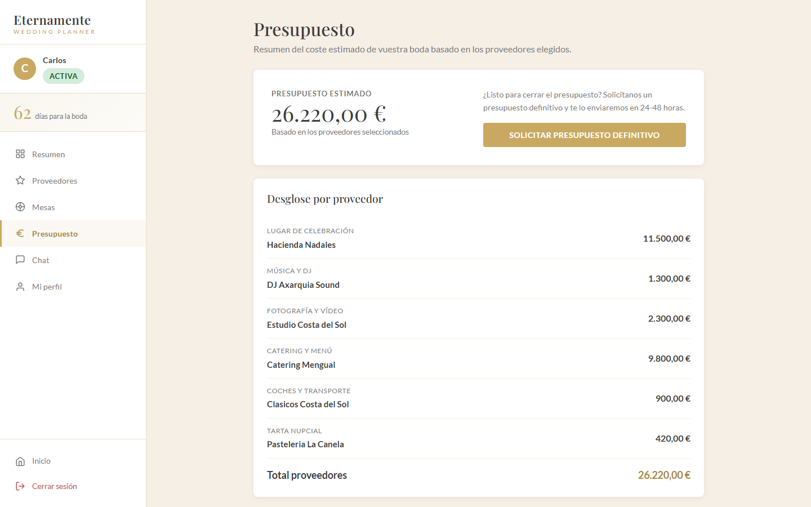

Pantalla donde puedes:

- Ver la **suma estimada** de todos los proveedores que has seleccionado en Personalización.
- Consultar el **listado de proveedores elegidos** con sus precios.
- Cuando estés conforme, pulsar **"Solicitar presupuesto definitivo"**. Tras una confirmación, el equipo de Eternamente recibirá tu solicitud y te enviará el presupuesto final cerrado.

Una vez solicitado, el botón se desactiva para evitar duplicados.

Si el equipo ha fijado ya un **presupuesto definitivo**, lo verás destacado en esta misma pantalla.

### 7.7. Chat con el equipo

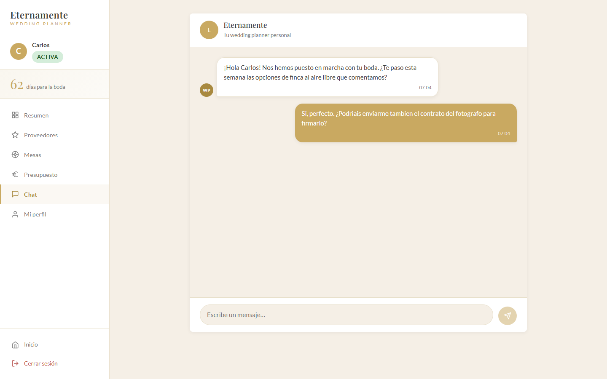

Conversación en tiempo casi real con tu wedding planner.

**Cómo usarlo:**

1. Escribe tu mensaje en la caja inferior.
2. Pulsa **Enter** para enviar (o **Mayús+Enter** para hacer un salto de línea sin enviar).
3. Tus mensajes aparecen alineados a la derecha; los del equipo, a la izquierda.
4. La conversación se actualiza automáticamente cada pocos segundos sin necesidad de recargar.
5. Los mensajes nuevos se marcan como leídos al abrir la pantalla.

### 7.8. Mi perfil

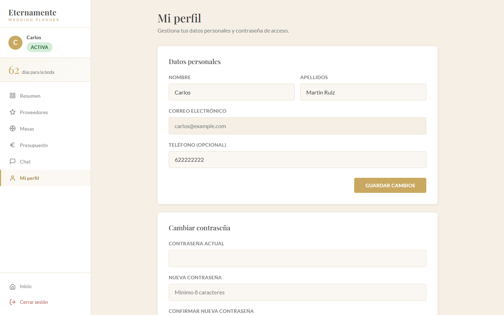

Pantalla con dos bloques independientes:

**Datos personales:**
- Edita tu **nombre**, **apellidos** y **teléfono**.
- Pulsa **Guardar perfil**.

**Cambiar contraseña:**
- Introduce tu **contraseña actual**.
- Escribe la **nueva contraseña** (mínimo 8 caracteres) y **confírmala**.
- Pulsa **Cambiar contraseña**.
- Si la contraseña actual es incorrecta o las nuevas no coinciden, verás un mensaje de error.

---

## 8. Panel del administrador (equipo Eternamente)

Si tu cuenta tiene rol de administrador, al iniciar sesión accederás al panel `/admin` con un menú lateral propio.

### 8.1. Dashboard

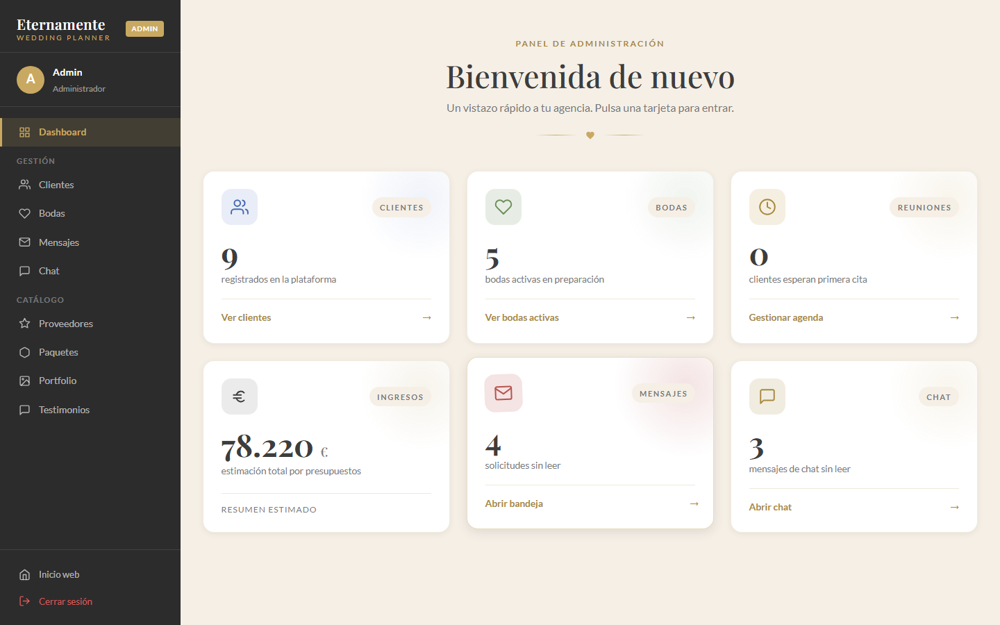

Vista general con:
- Número de bodas por estado (pendiente reunión, activas, finalizadas, canceladas).
- Total de clientes registrados.
- Mensajes de contacto sin leer.
- Chats con mensajes sin leer.
- Ingresos estimados.

Cada bloque enlaza con su sección correspondiente.

### 8.2. Bodas

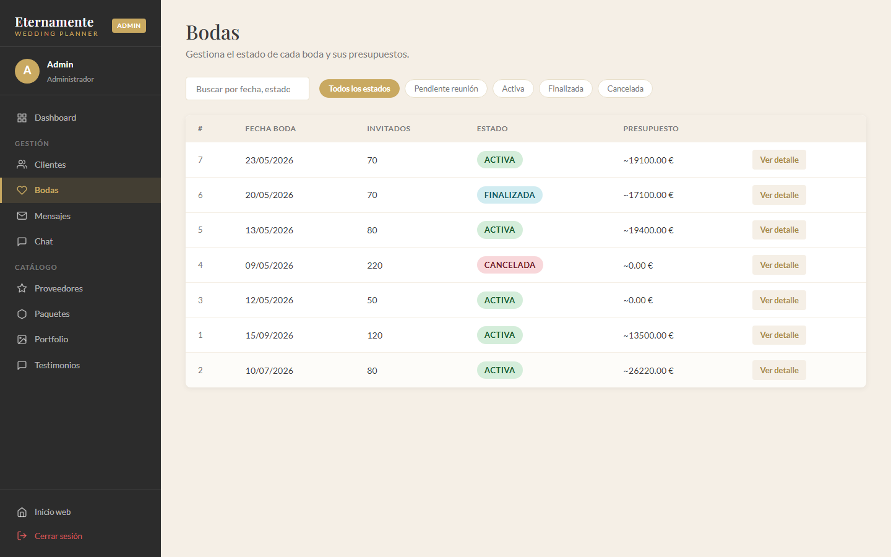

Listado de todas las bodas. Permite:
- **Filtrar por estado** (Todos, Pendiente reunión, Activa, Finalizada, Cancelada).
- **Buscar** por nombre de pareja.
- Pulsar una fila para entrar al **detalle**.

### 8.3. Detalle de boda

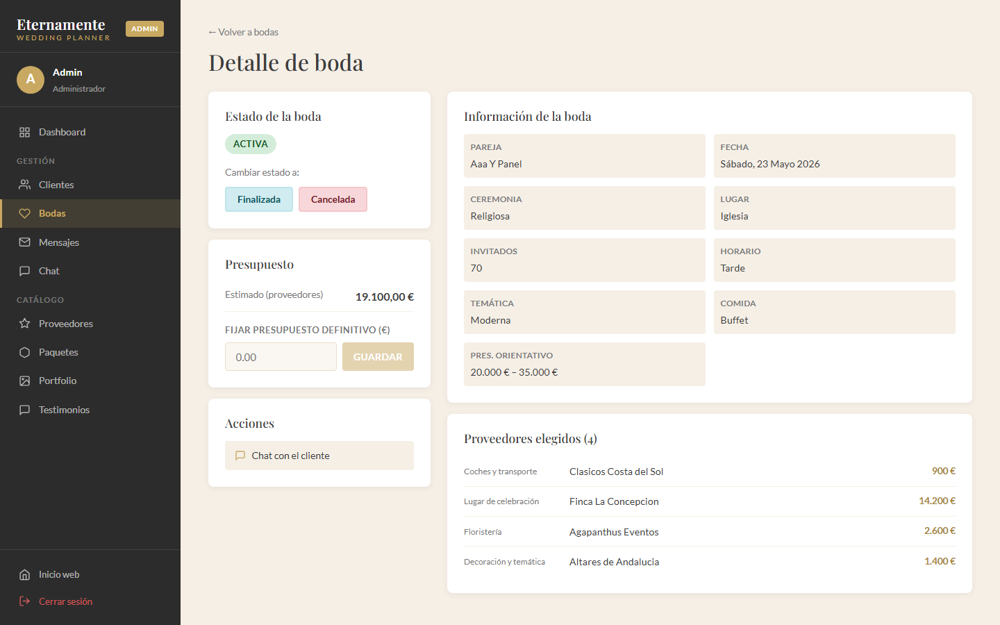

Vista con todos los datos del cuestionario, proveedores escogidos por la pareja y opciones para:
- **Cambiar el estado** según el flujo permitido:
  - `Pendiente reunión` → `Activa` o `Cancelada`.
  - `Activa` → `Finalizada` o `Cancelada`.
  - `Finalizada` y `Cancelada` son estados finales.
- **Fijar el presupuesto definitivo**: introduce la cifra y pulsa **Guardar**. La pareja la verá en su pantalla de Presupuesto.

### 8.4. Clientes

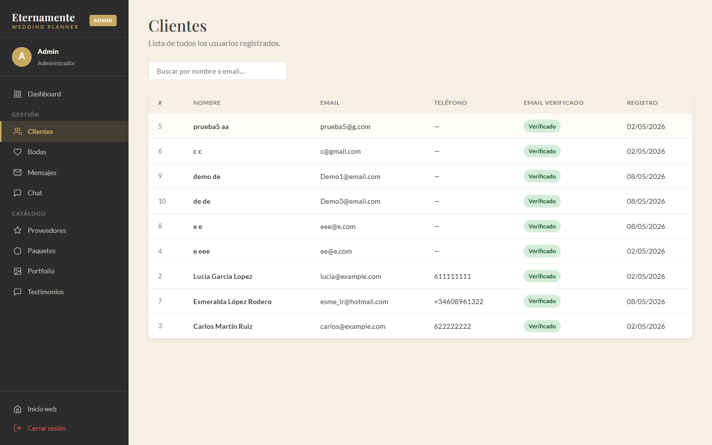

Listado de todas las parejas registradas. Permite:
- Buscar por nombre o email.
- Verificar manualmente el correo de un cliente que no haya recibido el email de verificación.

### 8.5. Catálogo
Cuatro subsecciones para mantener el contenido público de la web:

- **Proveedores**: alta, edición, eliminación y activación de cada proveedor (nombre, categoría, descripción, precio, foto).

  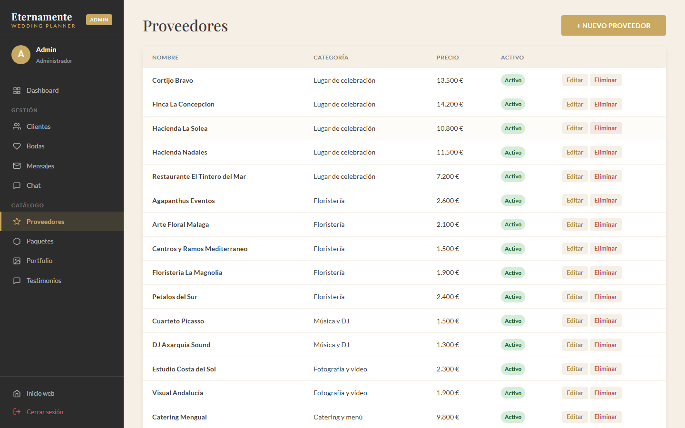

- **Paquetes**: gestión de los paquetes que se ven en la landing.

  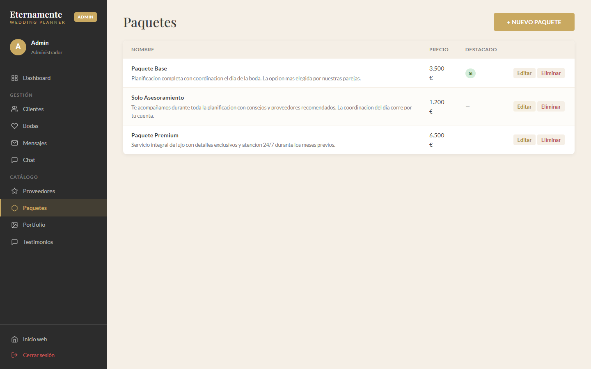

- **Portfolio**: gestión de las fotografías de bodas anteriores.

  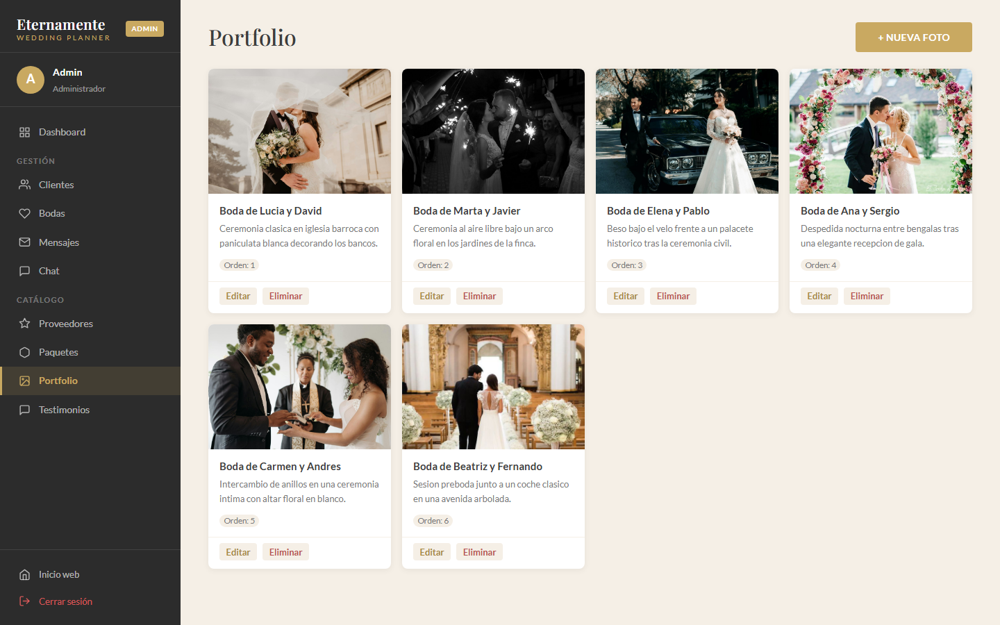

- **Testimonios**: gestión de las opiniones publicadas en la landing.

  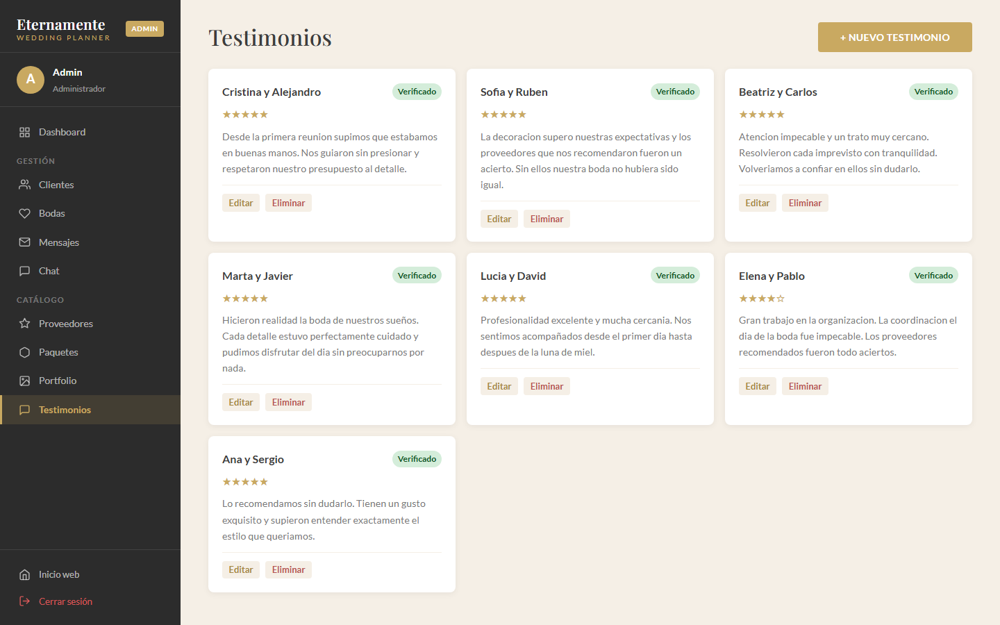

Todas las altas y ediciones se hacen mediante un formulario en modal (ventana emergente).

### 8.6. Mensajes de contacto

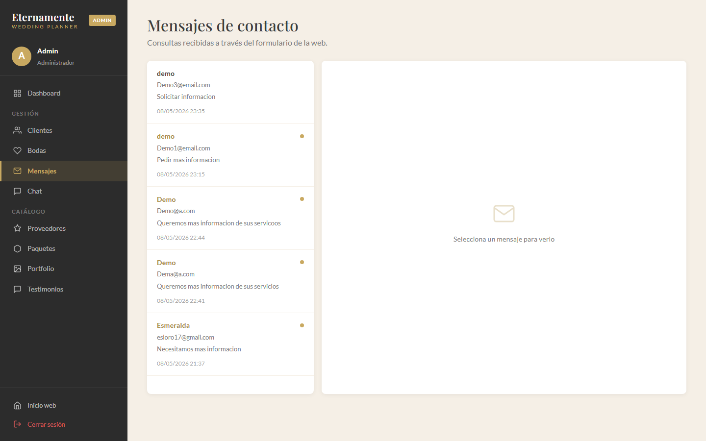

Bandeja con todos los mensajes recibidos por el formulario público de Contacto.
- Pulsa un mensaje para abrirlo y leer el contenido completo.
- Al abrirlo se marca automáticamente como leído.
- Puedes eliminar mensajes que ya no necesites.

### 8.7. Chat con clientes

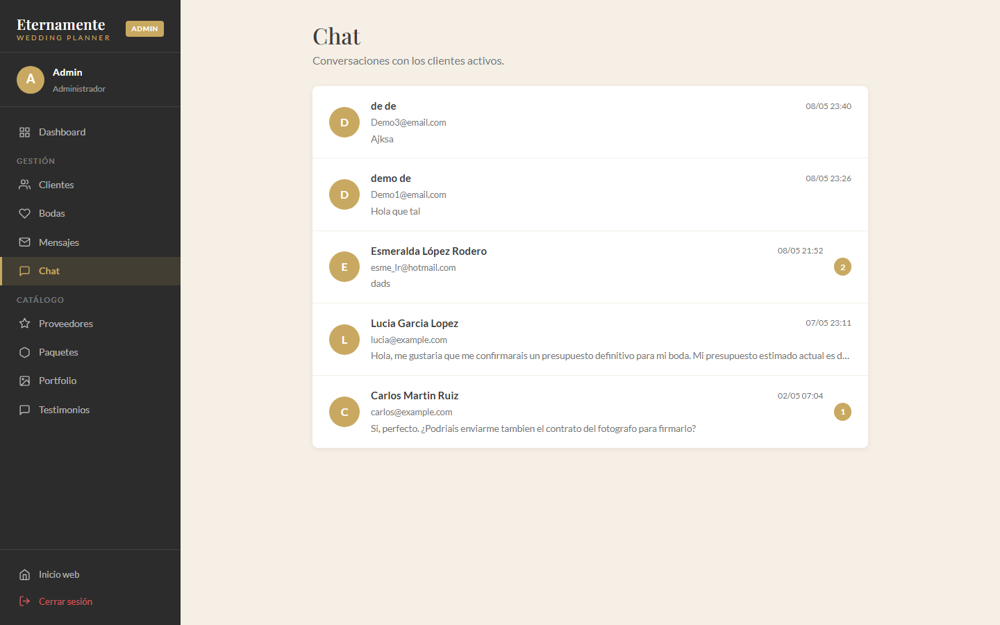

- Pantalla con la lista de **conversaciones** activas (una por boda) ordenadas por la última actividad.
- Cada fila muestra el cliente, estado de la boda, último mensaje y nº de mensajes sin leer.
- Pulsa una conversación para abrir el chat y responder a la pareja.

---

## 9. Cerrar sesión

Para salir de tu cuenta:

- En **escritorio**: pulsa tu nombre en la esquina superior derecha y selecciona **Cerrar sesión**.
- En **móvil**: abre el menú lateral y pulsa **Cerrar sesión**.

Volverás a la página de inicio sesión (clientes y administradores) o a la landing pública.

---

## 10. Estados de tu boda

A lo largo del proceso, tu boda va pasando por distintos estados:

| Estado | Significado |
|---|---|
| **Pendiente de reunión** | Has rellenado el cuestionario inicial. El equipo se pondrá en contacto contigo. |
| **Activa** | Has tenido la primera reunión y la boda está en plena planificación. Se desbloquean Personalización, Mesas, Presupuesto y Chat. |
| **Finalizada** | La boda ya se ha celebrado. Los datos quedan en modo solo lectura. |
| **Cancelada** | La boda no se va a celebrar. Los datos quedan en modo solo lectura. |

---

## 11. Preguntas frecuentes

**¿Necesito cuenta para enviar un mensaje desde Contacto?**
No. El formulario público de la landing no requiere registro.

**¿Puedo cambiar la fecha de mi boda después?**
Sí, desde **Resumen → Editar detalles**, siempre que la boda no esté finalizada o cancelada.

**¿Por qué no puedo entrar a Personalización o Mesas?**
Esas secciones se desbloquean cuando tu boda pasa al estado **Activa**, es decir, tras la primera reunión con el equipo.

**No me llega el email de verificación.**
Revisa la carpeta de **Spam o correo no deseado**. Si sigue sin aparecer, entra al panel y pulsa **"Reenviar email de verificación"**. Si tampoco así, contacta con el equipo desde el chat o el formulario público.

**¿Mis datos son privados?**
Sí. Solo tú y el equipo de Eternamente podéis ver los datos de tu boda. La sesión expira automáticamente y necesitas iniciarla de nuevo si pasa demasiado tiempo inactiva.

**He olvidado mi contraseña, ¿pierdo mi boda?**
No. Recupera la contraseña con el enlace **"¿Has olvidado tu contraseña?"** y todos tus datos seguirán intactos.

---

*Última actualización: 9 de mayo de 2026.*
