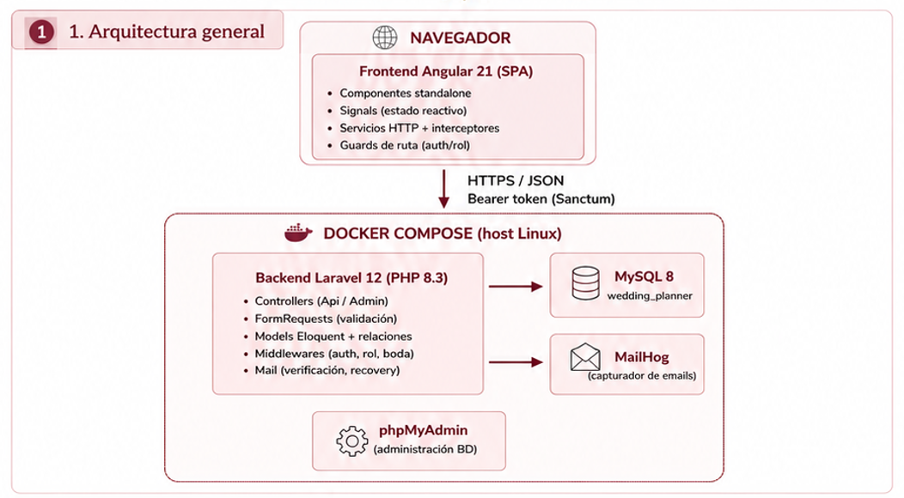
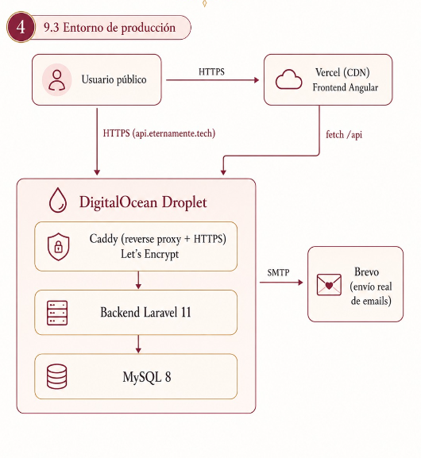
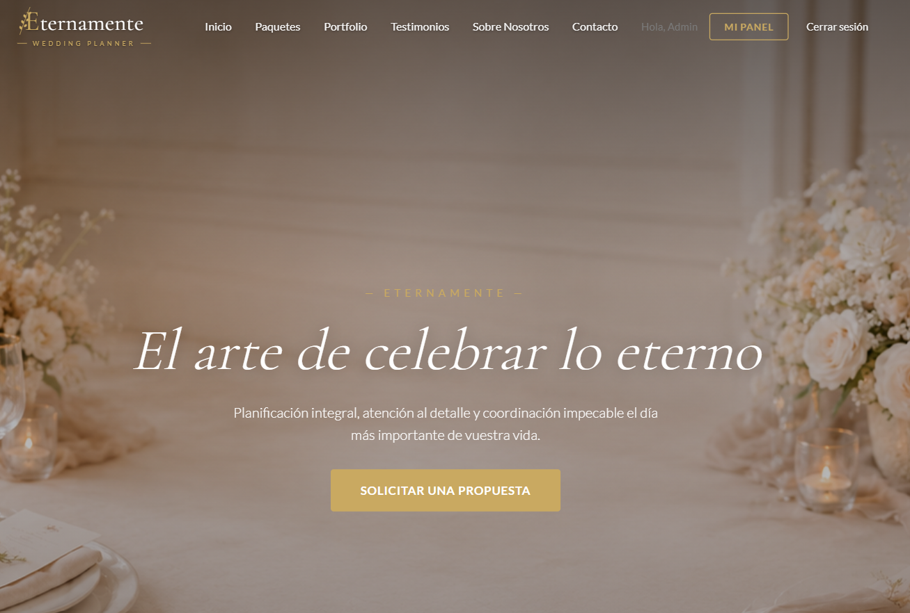
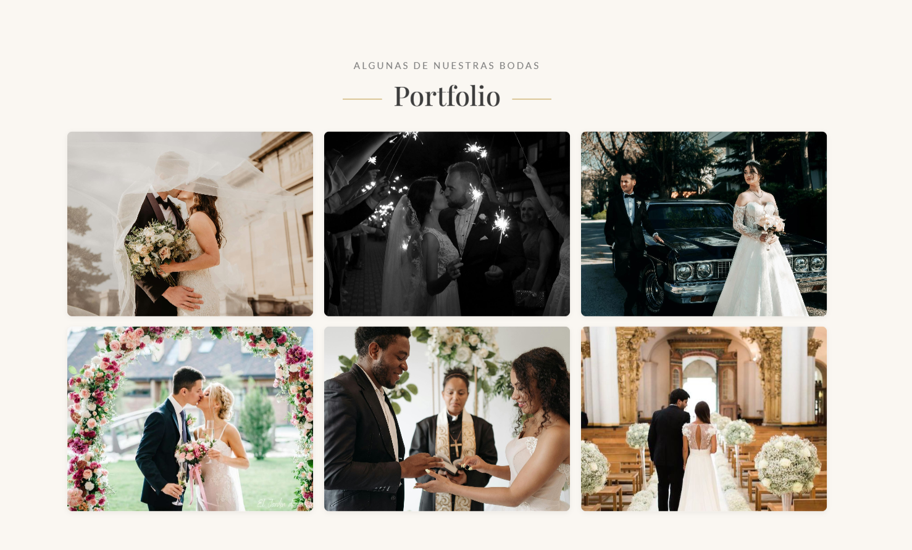
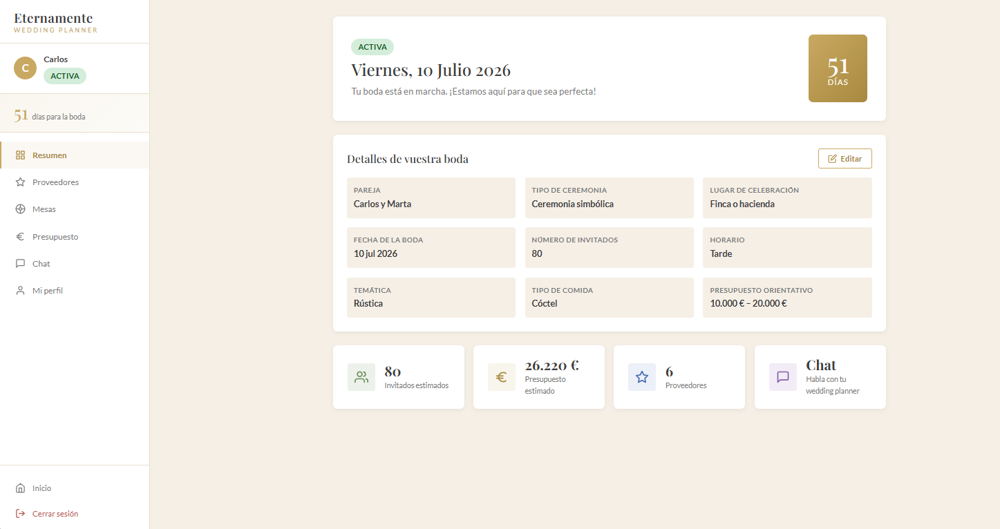
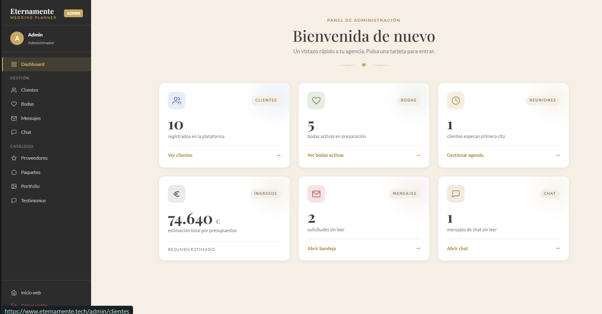

<div align="center">

# 💍 Eternamente

### Plataforma integral para una agencia de Wedding Planner


**Trabajo de Fin de Grado · 2º DAW · Esmeralda López**

🌐 **Aplicación desplegada en producción:** [**www.eternamente.tech**](https://www.eternamente.tech/)

📖 [Sobre el proyecto](#-sobre-el-proyecto) •
🛠 [Tecnologías](#-tecnologías) •
🎨 [Diseño visual](#-diseño-visual) •
🏛 [Arquitectura](#-arquitectura) •
✨ [Funcionalidades](#-funcionalidades) •
🚀 [Instalación](#-instalación) •
🖼 [Capturas](#-capturas)

</div>

---

## 📖 Sobre el proyecto

**Eternamente** es una aplicación web pensada como herramienta de trabajo real para una **agencia de wedding planner**. Va más allá de una simple landing de presentación: integra en un único producto la captación de clientes, la gestión interna de las bodas y el seguimiento día a día de cada pareja desde que rellena su primer cuestionario hasta el día del enlace.

La aplicación se compone de tres grandes bloques:

- **Una web pública** con catálogo de paquetes, portfolio, testimonios y formulario de contacto, pensada para que cualquier pareja interesada pueda informarse y reservar una primera reunión.
- **Un panel de cliente privado** donde cada pareja, una vez aceptada, completa los datos de su boda, elige proveedores, organiza invitados y mesas, sigue su presupuesto y se comunica con la agencia.
- **Un panel de administración** desde el que la agencia gestiona el catálogo, valida las bodas, fija presupuestos definitivos, lee los mensajes de contacto y mantiene un chat con cada cliente.

El proyecto está completamente **dockerizado**: con un único comando se levanta el frontend, el backend, la base de datos, phpMyAdmin y un servidor de correo de pruebas. No es necesario instalar PHP, Composer, Node ni Angular CLI en la máquina anfitriona.

Además, la aplicación está **desplegada en producción** y accesible públicamente en [**www.eternamente.tech**](https://www.eternamente.tech/). El frontend se sirve desde **Vercel**, mientras que el backend, la base de datos y el reverse proxy con HTTPS (Caddy + Let's Encrypt) se ejecutan en un **Droplet de DigitalOcean**.

---

## 🛠 Tecnologías

### Frontend

- **Angular 21** con _standalone components_ y lazy loading por ruta.
- **SCSS** para los estilos, sin frameworks pesados (nada de Bootstrap ni Tailwind: la UI es completamente propia).
- **RxJS** para la gestión reactiva de estado y peticiones HTTP.
- **Guardianes** (`auth.guard`, `admin.guard`) y **interceptores** propios para autenticación con tokens.

### Backend

- **Laravel 11** como framework principal.
- **Laravel Sanctum** para autenticación basada en tokens (SPA + API).
- **Eloquent ORM** con modelos en español (`Boda`, `Invitado`, `Mesa`, `Proveedor`...).
- **Sistema de notificaciones por correo** con verificación de email y confirmación firmada de eliminación de cuenta.
- **Middlewares personalizados** (`boda.activa`, `es.administrador`) para granular el acceso según rol y estado.

### Persistencia y entorno

- **MySQL 8** como base de datos principal.
- **phpMyAdmin** para inspección visual de la BD en desarrollo.
- **Mailhog** como servidor SMTP local en desarrollo: captura los emails sin enviarlos realmente.
- **Brevo** (antes Sendinblue) como proveedor SMTP en producción para el envío real de correos (verificación de email, recuperación de contraseña, confirmación de eliminación de cuenta).
- **Docker + Docker Compose** orquestando todos los servicios sobre una red interna.

### Despliegue

- **Vercel** para el frontend Angular (build estático y CDN).
- **DigitalOcean Droplet** para el backend, la base de datos y el reverse proxy.
- **Caddy** como reverse proxy con **HTTPS automático** (Let's Encrypt).

---

## 🎨 Diseño visual

El estilo visual busca transmitir **elegancia, calma y romanticismo**, evitando saturación de color. Toda la UI está construida sobre **variables CSS** definidas en `frontend/src/styles.scss`, sin frameworks de diseño: cada componente es propio y consistente con el sistema.

### Paleta de colores

Una paleta neutra inspirada en la papelería de boda: fondos beige cálidos, dorados como color de acento y un texto en gris oscuro para máxima legibilidad.

| Rol                   | Variable                   | HEX       | Muestra                                                  |
| --------------------- | -------------------------- | --------- | -------------------------------------------------------- |
| Fondo principal       | `--color-fondo`            | `#F5EFE6` |  |
| Beige medio           | `--color-beige-medio`      | `#E8DFCA` |  |
| Dorado (acento)       | `--color-dorado`           | `#C9A961` |  |
| Dorado oscuro (hover) | `--color-dorado-oscuro`    | `#A8893F` |  |
| Blanco roto           | `--color-blanco-roto`      | `#FAF7F2` |  |
| Texto principal       | `--color-texto`            | `#3D3D3D` |  |
| Texto secundario      | `--color-texto-secundario` | `#7A7A7A` |  |
| Éxito                 | `--color-exito`            | `#6B8E5A` |  |
| Error                 | `--color-error`            | `#B85450` |  |

### Tipografías

Tipografía clásica de **serif + sans-serif**, importadas desde Google Fonts:

- **Playfair Display** (serif) — titulares y logotipo. Aporta carácter editorial y un aire formal de invitación impresa.
- **Lato** (sans-serif) — cuerpo de texto, botones, etiquetas y formularios. Limpia y muy legible incluso en tamaños pequeños.

### Principios de estilo

- **Mucho aire**: espaciados generosos (`--espacio-xl: 6rem` entre secciones) y `max-width: 1200px` para que el contenido respire.
- **Botones planos con acento dorado**: mayúsculas, _letter-spacing_ amplio y elevación sutil al pasar el ratón.
- **Tarjetas suaves** con sombras ligeras y bordes redondeados (`--radio-medio: 8px`).
- **Animaciones discretas**: aparición progresiva al hacer scroll (directiva propia `ScrollRevealDirective`), fade-in del hero y micro-bounces en iconos.
- **Adaptable**: tipografías con `clamp()` y media queries para que la lectura sea cómoda desde móvil hasta pantallas grandes.

---

## 🏛 Arquitectura

### Entorno de desarrollo (local, con Docker)

<div align="center">
  


### Entorno de producción


  

  
</div>


El frontend Angular consume la API REST que expone Laravel bajo el prefijo `/api`. Sanctum emite tokens en el login que el frontend almacena y reenvía en cada petición mediante un _interceptor_. Las rutas del backend están agrupadas en cuatro niveles de acceso: **públicas**, **autenticadas**, **cliente con boda activa** y **administrador**.

---

## ✨ Funcionalidades

### 🌐 Web pública (sin login)

- Landing con secciones de presentación, paquetes, portfolio, testimonios y formulario de contacto.
- Registro de nuevos clientes con verificación de email obligatoria.
- Recuperación de contraseña por correo.

### 👰 Panel del cliente

- **Cuestionario inicial** con los datos de la boda (fecha, número de invitados, estilo, presupuesto orientativo...).
- **Estado de la boda**: tras enviar el cuestionario, la pareja queda _pendiente de reunión_ hasta que la agencia activa su boda.
- **Selección de proveedores** por categoría (catering, fotografía, floristería, música...).
- **Gestión de invitados** con CRUD completo y número de acompañantes.
- **Organizador de mesas** con asignación de invitados (drag & drop).
- **Presupuesto en vivo** con desglose por proveedor y posibilidad de solicitar el presupuesto definitivo al admin.
- **Chat privado** con la agencia.
- **Mi perfil**: cambio de datos, cambio de contraseña y eliminación de cuenta con confirmación por correo.

### 🛡 Panel del administrador

- **Dashboard** con estadísticas globales (bodas activas, ingresos, próximas fechas...).
- **Gestión de clientes**: verificar emails manualmente, ver detalle, eliminar cuentas.
- **Gestión de bodas**: revisar cuestionarios, cambiar estado (pendiente / activa / finalizada) y fijar presupuesto definitivo.
- **Catálogo editable**: CRUD completo de proveedores, paquetes, portfolio y testimonios.
- **Mensajes de contacto** recibidos desde la landing, con marca de leído/no leído.
- **Chat centralizado** con todas las conversaciones activas.

---

## 🚀 Instalación

### Requisitos previos

- **Docker Desktop** 24+ con Docker Compose v2.
- ~3 GB libres de disco.
- Puertos libres en el host: `4200`, `8000`, `3306`, `8080`, `8025`, `1025`.

> No hace falta tener PHP, Composer, Node ni Angular CLI instalados: todo se ejecuta en contenedores.

### Pasos

```bash
# 1. Clonar el repositorio
git clone https://github.com/<tu-usuario>/eternamente.git
cd eternamente

# 2. Levantar todos los servicios
docker compose up -d

# 3. Verificar que los contenedores están arriba
docker compose ps

# 4. Ejecutar migraciones y cargar datos de demo
docker compose exec backend php artisan migrate --seed
```

### URLs y servicios

| Servicio    | URL                       | Notas                            |
| ----------- | ------------------------- | -------------------------------- |
| Frontend    | http://localhost:4200     | Angular con hot reload           |
| Backend API | http://localhost:8000/api | Laravel + Sanctum                |
| phpMyAdmin  | http://localhost:8080     | Usuario `root` / `rootpass`      |
| Mailhog     | http://localhost:8025     | Bandeja de correos de desarrollo |
| MySQL       | localhost:3306            | BD `wedding_planner`             |

### Detener el entorno

```bash
docker compose down        # mantiene los datos de MySQL
docker compose down -v     # ELIMINA el volumen de MySQL (cuidado)
```

### Comandos útiles

**Ver logs de un servicio:**

```bash
docker compose logs -f frontend
docker compose logs -f backend
docker compose logs -f mysql
```

**Entrar a un contenedor:**

```bash
docker compose exec backend bash      # shell en el contenedor de Laravel
docker compose exec frontend sh       # shell en el contenedor de Angular
docker compose exec mysql bash        # shell en el contenedor de MySQL
```

**Comandos de Laravel:**

```bash
docker compose exec backend php artisan migrate
docker compose exec backend php artisan db:seed
docker compose exec backend php artisan tinker
```

**Comandos de Angular:**

```bash
docker compose exec frontend ng generate component nombre-componente
docker compose exec frontend ng build
```

**Reconstruir imágenes (tras tocar Dockerfiles):**

```bash
docker compose build --no-cache
docker compose up -d
```

### Build de producción

El `Dockerfile` del frontend tiene tres targets: `development`, `build` y `production`. Por defecto `docker-compose.yml` usa `development`. Para generar la imagen de producción:

```bash
docker build -t eternamente-frontend:prod --target production ./frontend
docker run -d -p 80:80 eternamente-frontend:prod
```

Para desplegar el backend en producción se utiliza `docker-compose.prod.yml`, que levanta Caddy + Laravel + MySQL en el Droplet:

```bash
docker compose -f docker-compose.prod.yml up -d --build
```

---

## 🖼 Capturas

<div align="center">

**Landing pública**



**Panel del cliente — Resumen de la boda**


**Panel del administrador — Dashboard**


</div>

---

## 👩‍💻 Autora

**Esmeralda López Rodero**
2º DAW · Curso 2025-2026
📧 esmeralda.lrodero@gmail.com

---

<div align="center">

_Proyecto desarrollado como Trabajo de Fin de Grado del ciclo de Desarrollo de Aplicaciones Web._

</div>
